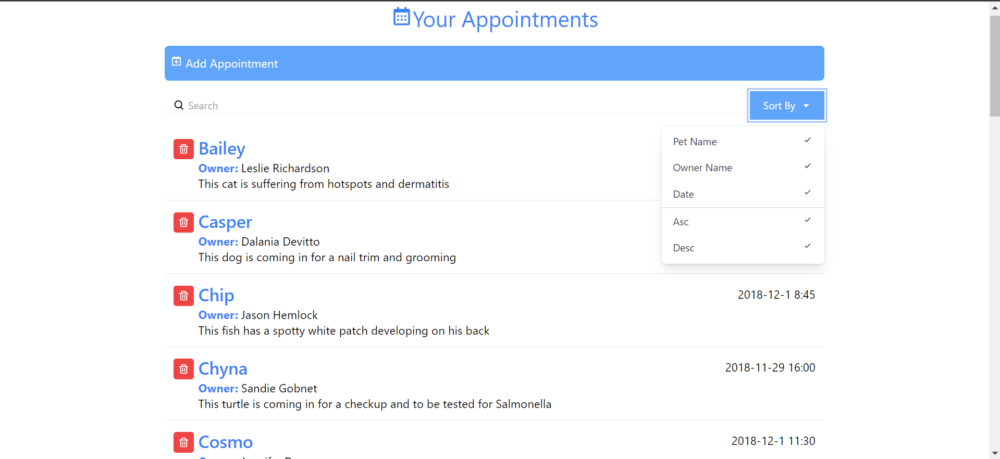

# Appointment-UI

## Appointment System UI
This is a User Interface for an Appointment System (this example uses data for a fictional veterinary) styled with Tailwind CSS and made in React.js using Hooks and functional components.

The UI allows for sorting (in ascending and descending order) and searching by the Pet Name, the Owner Name, and the Date. A collapsible widget for adding new appointments is provided, and every appointment component has its delete button.

To run this project locally you need to have Node.js and npm installed. If you don't have Node, you can get it [here](https://nodejs.org/en/).
To open a development server and explore the interface, open a terminal in the project folder and run the 'npm start' command. This will open a server at http://localhost:3000/

